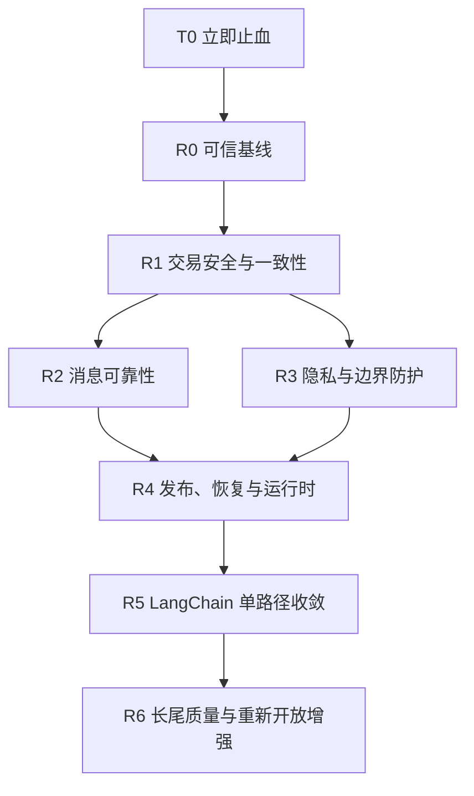

# 全局风险整改与框架收敛可执行计划书

> trace_id: `20260711-global-risk-remediation`
> source: `AUDIT-20260711-GLOBAL-REVIEW`
> 日期：2026-07-11
> 基线：生产当前版本 `0.107.13`（本列车）；计划基线提交为历史审计提交 `7e666218275a5040e0c3ab9c648f4cb9a53bac74`
> 状态：R0-A/R0-B/R0-C、R1-A、R1-B、R1-C、R2-A、R2-B、R3-A、R3-B、R4-A、R4-B、R4-C、R5-A 和 R6 已完成本地首片并通过对应门禁；生产同构隔离整改 Harness 已用真实 Bearer JWT/FastAPI/service/repository/SQLite 和独立子进程 kill 完成主体删除与消息重领 `8/8` 验证。R2-B 已有生产重启、真实进程崩溃恢复和 inbox 汇总证据，但有处理中真实业务消息时的丢失/重复专项仍未完成；R3-A 完整生产隐私出站专项已通过聚合门禁 `8/8`，真实生产主体删除仍未完成；R3-B 已统一商品目录/客服卡片远程下载入口，并将员工 Agent 运营权限收敛为服务端 ops 用户白名单和执行前工具门禁。生产 `0.107.13` 的员工授权、反向代理、readiness、callback `61/61`、本地受控 trace sink、迁移 dry-run 及独立设备 staging 的 migration apply/rollback 均已验证；无法可靠确认的业务事实和 callback 异常已统一收敛为转人工。本地 D 盘长期加密备份已配置每天 03:30 的 Windows 计划任务，默认保留 30 天且至少 3 份；生产持久挂载仍未配置；容器 build/smoke 仍未完成。全量测试已串行通过。
> 决策依据：[ADR 0005：框架优先与单一路径治理](../harness-engineering/adr/0005-framework-first-single-path.md)

## 一、执行结论

当前不应继续把主要精力投入新功能、作品集增强或 LangSmith / RAG 扩大灰度。先完成两条 P0 风险链和关键 P1 生产底座：

1. 关闭“伪造身份 -> 客户端定价 -> mock-pay -> paid”攻击链。
2. 把生产快照从“删若干旧表”改为“只导出允许表和允许列”，阻断 PII 进入本地评测库。
3. 修复测试收集、CI、readiness 和发布恢复，使后续整改有可信门禁。
4. 按交易一致性、消息可靠性、隐私治理、运行时和 AI 框架收敛依次推进。

执行采用“发布列车”而不是“一个文件一个提交”：工作包内只跑定向测试，工作包尾跑域级门禁，整列车出站前才跑全量门禁和集中推送。预计 6-9 个可回滚提交，不制造几十个 micro-commit。

现有 [LangChain AI 应用层后续增强计划](./langchain-ai-layer-next-enhancement-execution-plan.md) 保留为后续专项。其 E1-E6 在本计划 R0-R4 的上线阻断项关闭前暂停扩大生产范围，不伪造 readiness，不启用 LangSmith 外发，不扩大 RAG 热路径。

## 二、不可突破的约束

### 2.1 框架优先，但边界优先于框架

决策顺序固定为：

```text
现有框架公开能力
  -> 官方扩展或成熟组件
  -> 薄 adapter
  -> 有 ADR、owner 和退出条件的自研例外
```

AI 应用层优先复用当前已经固定版本的 LangChain / LangGraph / LangSmith。认证、支付、数据库事务、幂等、队列、隐私和发布恢复使用对应领域的成熟标准，不塞进 LangChain。

### 2.2 不允许长期半框架、半自研

- 不新增第二套模型请求、tool schema、tool loop、graph runner、structured output 解析或 trace runner。
- 兼容 facade 只能在一个发布列车内用于回滚，必须有删除条件。
- 同一种能力只能有一个生产默认入口；禁止长期双写、双跑、双配置。
- 业务规则、授权和金额校验不能交给 Prompt、LLM 或 tool 描述。
- 框架没有合适能力时可以保留窄 adapter，但必须说明为什么不能复用。

### 2.3 暂不做“大一统重写”

P0/P1 阶段不同时重写 ORM、迁移器、任务队列和所有 LLM 调用。每个工作包只解决一个可验收风险面；框架替换必须减少一套旧实现，而不是只增加 adapter。

### 2.4 删除、临时文件和生产数据红线

- 禁止批量或递归删除文件、目录。
- 删除只能针对一个明确文件路径；目录或多文件清理由用户人工确认处理。
- 下载、缓存、构建和临时产物放在 D 盘明确路径。
- 任何生产快照、原始客服记录和 RAG 原始 query 默认不入仓。

## 三、当前工作区处置

本节必须在任何代码整改前执行。在本轮落文档前，Git 工作区只有一项 tracked 修改：

| 路径 / 内容 | 来源判断 | 处置决定 | 是否进入下一提交 |
|---|---|---|---|
| `docs/architecture/langchain-ai-layer-next-enhancement-execution-plan.md` 中 `real_sample_ready` 被改为 `rea l_sample_ready` | 本轮审计前已存在的单字符误改 | 执行时精确恢复这一行；不连带恢复该文件其他内容 | 否 |
| 本计划、ADR 0005、导航、LOGBOOK 和当前态提示 | 本轮计划产物 | 保留并继续修改，文档验收后形成 1 个 docs commit | 是 |
| `data/vector_last_duration.json` | `check_project.py` 运行时生成，已被 `data/` ignore | 不 stage、不提交、不以脚本批量清理 | 否 |
| `reports/portfolio/langchain-ai-layer-evidence-packet.json` | 审计门禁生成，已被 `reports/*` ignore | 不 stage、不提交；需要保留时只作为本地证据 | 否 |
| `D:\Temp\pytest-of-srafy` | Pytest 临时目录，不属于 Git 工作区 | 因禁止递归删除，不由 Agent 清理目录；由用户人工决定 | 否 |

执行规则：

1. 先重新运行 `git status --short --branch` 和 `git diff --name-status`。
2. 若只存在表内内容，按表执行；若出现新文件或新 diff，停止提交并先判定来源。
3. 精确恢复误改后，运行 `git diff --check`，确认没有把用户其他改动带入。
4. 本轮计划文档经用户确认后再形成一个 `docs:` 提交；只集中推送一次，不在每个文档编辑后提交。
5. 当前计划阶段不自动 commit、push 或部署。

## 四、风险总账与工作包映射

### P0：立即阻断

| ID | 风险 | 影响 | 工作包 |
|---|---|---|---|
| P0-ORDER | 前台身份头可伪造、目录外商品和客户端价格被接受、生产公开 mock-pay 并直接写 paid | 可伪造已支付订单，污染库存和履约 | R0-T0、R1-A |
| P0-SNAPSHOT | 生产快照只清理旧表，新地址、客户、身份、画像、摘要和群登记表仍可保留 PII | 真实个人数据可能进入本地评测或被误分发 | R0-B |

### P1：上线阻断

| ID | 风险 | 主要整改 | 工作包 |
|---|---|---|---|
| P1-AUTH | 全前台无可验证会话，订单、地址、聊天、群登记存在 BOLA/IDOR | 服务端会话、统一身份依赖、资源归属校验 | R1-A |
| P1-PAY | 支付通知未核对商户、应用、金额、币种和交易号唯一性；微信支付开关当前关闭，启用即触发 | 完整通知合同、条件状态迁移、交易幂等 | R1-A |
| P1-TX | Repository 多处自行 `commit()`，外层事务不能原子回滚 | Unit of Work、Repository 禁止提交、故障注入 | R1-B |
| P1-IDEMPOTENCY | 消息先查后插，`channel_msg_id` 无唯一约束 | 清理重复、唯一约束、原子 claim | R2-A |
| P1-QUEUE | Webhook 先 ACK、内存队列满或进程退出时永久丢消息 | 持久 inbox/outbox、重试、drain、恢复 | R2-B |
| P1-WORKERS | README 推荐 4 workers，但迁移、调度、队列和向量写入均是进程内状态 | 先固定单 worker，再拆独立 worker / leader | R2-B、R4-C |
| P1-TEST | 标准 Pytest 无法收集；绕过后仍有 8 项失败 | 修复收集和真实失败，恢复唯一标准命令 | R0-C |
| P1-CI | CI 调不存在的 seed、准备废弃向量文件、部署错误分支 | hermetic fixture、精确 SHA、暂禁自动部署 | R0-C、R4-B |
| P1-READY | degraded 仍返回 200，metadata `ready=false` 也可通过 | `ready=503`、真实 app state、轻重检查分离 | R4-A |
| P1-DEPLOY | 发布吞依赖失败，残留 tmp 可覆盖生产库，无自动回滚 | 代码/数据发布拆分、manifest、备份、严格回滚 | R4-B |
| P1-LLM | provider 配置漂移，旧调用默认走 DeepSeek | 单一 provider/model resolver | R5-A |
| P1-LIFECYCLE | 每轮新建 HTTP 客户端，每请求重新编译客户 graph | lifespan 持有 model transport 和 compiled graph | R5-A |
| P1-PRIVACY | consent unknown 仍写画像，原始会话外发 LLM | opt-in、撤回删除、外发脱敏、分能力开关 | R3-A |
| P1-ADMIN | 向量重建无管理员鉴权，静态 Token 长期驻留 localStorage | Cookie-only 短会话、CSRF/Origin、限流、RBAC 演进 | R1-C |
| P1-ALERT | 告警依赖 `aiohttp` 但未声明，卡死 processing 不告警 | 复用已锁定 `httpx`、stuck 规则、启动自检 | R4-A |
| P1-TRACE | Agent trace 在热路径生成后被丢弃 | 标准 callback/sink、采样和隐私门禁 | R5-B |

### P2/P3：在主链稳定后收口

| 领域 | 已确认问题 | 工作包 |
|---|---|---|
| 安全边界 | 请求体/并发/成本无限流、Webhook 重放、Secret 缺失降级、订单工具越权、SSRF/无界下载、员工机器人无细粒度授权 | R1-C、R3-B |
| 数据治理 | query 原文长期保存、敏感数据无 TTL/主体删除、容器权限过大 | R3-A、R4-C |
| 运行时 | 后台任务 ContextVar 复用关闭连接、任务所有权分散、N+1、异常降级丢上下文 | R2-B、R6 |
| 代码质量 | MyPy 161 errors、Ruff 3 errors、私有 `_db` 穿透、循环依赖、若干职责混杂大模块 | R6 |
| 前端 | 类型检查通过但无单元/E2E，`v-html` 与 localStorage Token 组合风险 | R1-C、R4-C |
| 供应链/恢复 | Docker 非 root 缺失、dev 依赖进入生产、DB 路径不一致、备份不支持灾难恢复 | R4-B、R4-C |
| 文档/Harness | README 漂移、证据索引不验证文件可取回、运维脚本违反删除红线 | R4-B、R6 |

## 五、依赖顺序与发布列车



并行原则：

- T0 完成后，R0-B 快照和 R0-C 测试/CI 可并行。
- R1-A 攻击链必须同批上线，不能拆开恢复订单入口。
- R1-B 订单 Unit of Work 可与 R1-C 后台认证并行，但必须在 R1 发布前合并验证。
- R2 与 R3 可并行开发，生产发布分开，避免消息迁移和隐私迁移同批。
- R5 不阻塞 P0/P1 修复，但在 R5 前冻结新增自研 AI 通用能力。

工期是单人有效工程日估算，不包含等待生产权限、真实数据持有人或人工合规审批的时间。

## 六、R0：立即止血与可信基线（0.5-2 天）

### R0-T0：生产立即止血

先做可逆的配置和网关动作，不等待大版本开发：

审计只确认本地配置当前启用了 offline review、关闭了微信支付，并确认本地有赞 Secret 非空；这些值不能替代生产真值。执行 T0 前先只读核对生产环境和路由，不在计划中假定线上状态。

1. 网关阻断生产 `mock-pay`，业务侧不把 `payment_method=mock` 作为履约依据。
2. 真实认证完成前关闭前台订单写入，至少关闭创建、取消、支付准备和支付确认。
3. 阻断匿名向量重建，后台临时限制为 VPN / IP allowlist。
4. 设置 `ENABLE_OFFLINE_REVIEW=false`，暂停会话外发；仅关闭 customer memory 不够。
5. 暂停客户订单/物流工具，未绑定真实身份时统一转人工。
6. 生产固定单 worker；限制 7001 到回环地址并启用 HTTPS、body cap、并发和基础限流。
7. Webhook Secret 缺失时 fail closed，不允许带空 Secret 继续工作。

退出条件：匿名请求不能创建可履约订单、不能写 paid、不能触发向量重建；离线任务不再外发会话；生产运行时为单 worker。

### R0-A：工作区与计划基线

1. 按第三节精确恢复 `rea l_sample_ready` 误改。
2. 核对新增计划、ADR、导航、LOGBOOK 和进度提示。
3. 只跑文档与 Harness 检查，不跑全量测试。
4. 用户确认后形成 1 个 docs commit，并一次性推送；未确认前保持未提交。

### R0-B：生产快照白名单化

实现要求：

- 新建空 SQLite 目标库，只创建并导出明确允许的表和列。
- 默认只允许知识库、商品目录等非个人数据；不从黑名单推断安全。
- 禁止默认 `--raw`；原始快照失败时不留下可误用产物。
- 合成一个包含当前全部 PII 表的测试库，断言输出表集合、列集合和敏感模式。
- schema 新增表时，快照测试默认失败，直到显式加入允许清单。

域级门禁：新增 `tests/scripts/test_pull_prod_snapshot.py` 或等价跨平台合同测试；断言地址、客户、身份、画像、摘要、群登记和原始消息均不存在。

### R0-C：测试收集和 CI 基线

1. 修复旧常量导入和两组同名测试模块，恢复 `python -m pytest tests/ -q` 可收集。
2. 修复绕过收集后暴露的 8 项真实失败，不用 skip/xfail 掩盖。
3. CI 使用合成 fixture，不依赖 ignored report、真实模型 key 或废弃 `embeddings.pkl`。
4. 删除不存在的 seed 调用；构建后台前端并使用真实 `.npy/.json` 合同。
5. 自动部署保持关闭，直到 R4-B 完成。

退出条件：标准 Pytest 命令通过；Ruff 当前 3 项错误清零；CI 本地等价命令可重复执行。审计已完成一次失败基线，本工作包完成前不重复跑全量。

## 七、R1：交易安全与一致性（3-6 天）

### R1-A：认证、归属、服务端定价和支付闭环

状态：已完成本地实施与验证（2026-07-11）。

以下项目必须作为同一发布能力完成：

1. 使用成熟 JWT / session 库签发服务端可验证凭证，默认评估 PyJWT；禁止手写签名、过期和刷新协议。
2. 统一 FastAPI 认证依赖，从认证上下文获取 user identity；业务接口不再信任 `x-miniapp-user-id`。
3. 地址、订单、聊天、群登记、客户订单/物流 tools 全部校验资源归属。
4. 商品必须存在于服务端目录；标题、价格、库存和可售状态只取服务端。
5. 生产不注册 mock-pay；测试替身只能通过测试装配注入。
6. 支付通知校验 `mchid`、`appid`、`amount.total`、`currency`、`out_trade_no` 和唯一 `transaction_id`。
7. 支付状态只允许条件迁移 `unpaid -> paid`；错金额、错商户、重复交易均不得改库。

优先使用微信支付官方或维护活跃 SDK 处理协议和密码学；若当前 SDK 不满足 MiNiApp/支付 v3 合同，只保留窄验签 adapter，业务字段校验仍在 service。

验收重点：伪造用户头、跨用户 IDOR、虚构商品、客户端改价、mock-pay、错金额、错商户、重复交易号全部返回 401/403/404/409，数据库和库存无变化。

本轮完成：Bearer 认证统一依赖、资源归属校验、服务端商品定价、生产 mock-pay 默认关闭、微信通知商户/appid/金额/币种校验、交易号唯一账本和重复通知幂等；定向认证/订单/支付测试与全量 Pytest、Ruff、项目红线/合约门禁通过。生产未访问，未提交、未推送、未部署。

### R1-B：订单域 Unit of Work

状态：已完成首批订单写路径本地实施与验证（2026-07-11）。

1. Repository 只执行 SQL，不自行 `commit()`。
2. service 层明确事务边界；先改订单创建、库存预占、订单事件和支付状态。
3. 对每个写入点做故障注入，证明外层 rollback 能恢复一致状态。
4. 分域迁移剩余 Repository，不做一次性全仓机械替换。
5. 增加静态检查，阻止新的 Repository `commit()`。

首批事务合同：

```text
创建订单 = 校验服务端商品/价格 -> 预占库存 -> 创建 unpaid 订单 -> 写时间线
  支付回调 = 校验业务字段 -> 原子 claim 交易 -> 条件置 paid -> 写支付事件
  ```

本轮完成：新增可嵌套事务上下文；订单应用服务统一承接订单创建、取消、支付、超时关闭和后台状态流转的提交/回滚；订单、库存、订单事件和订单创建会话仓库移除内部提交；支付成功事件纳入支付事务；新增 repository 事务静态门禁与订单创建/支付回调故障注入回滚测试。完整测试和项目门禁通过。生产未访问，未提交、未推送、未部署。

### R1-C：后台认证和边缘防护

状态：本地实施与验证已完成（2026-07-11）；`0.107.10` 生产反向代理、版本、readiness 和员工授权已复验。

- 向量重建纳入 admin 认证、单实例互斥和限流。
- 后台改为 HttpOnly + Secure 短会话，移除 localStorage Bearer，增加 CSRF / Origin 和登录限流。
- R1 末尾旋转旧 ADMIN token，使浏览器残留 token 失效。
  - 公共入口增加 ASGI 和反向代理双层 body cap、并发限制、身份/IP/业务限流和成本熔断。
  - 生产关闭或限制 `/docs`、`openapi.json`，补安全响应头。

完成内容：后台登录改为短时签名 HttpOnly/Secure Cookie，默认关闭长期 Bearer 兼容；增加 Origin 校验；向量状态与重建接口纳入 admin 鉴权；前端移除 `localStorage` token 和自动 Bearer 注入；启动检查与 readiness 同时要求 `ADMIN_API_TOKEN` 和 `ADMIN_SESSION_SECRET`。ASGI 层已增加 Content-Length 与实际 receive 累计 body cap、并发信号量、登录失败限流、单进程 IP 窗口限流、安全响应头，默认关闭 `/docs`、`/openapi.json`；后台 AI 调试接口增加失败熔断和冷却探针；新增 Nginx body cap、限流、超时和文档边界配置合同。单进程限流仍需与生产单 worker/代理全局限流配套，配置应用和生产只读复验待授权执行。

R1 出站条件：攻击链负向 E2E、订单事务故障注入和后台鉴权测试全部通过。任何一项未通过，订单和支付入口保持关闭。

## 八、R2：消息幂等与可靠任务（4-7 天）

### R2-A：数据库原子幂等

状态：本地实施与验证已完成（2026-07-11）；历史重复报告为 0 组，唯一索引已进入本地迁移；生产重启/真实消息丢失与重复专项尚未形成独立证据。

1. 上唯一约束前先报告并处理历史重复数据。
2. `channel_msg_id` 和渠道消息键使用数据库唯一约束。
3. 用 `INSERT ... ON CONFLICT DO NOTHING` 或等价原子语义认领消息，删除“先查后插”。
4. 活跃会话、支付交易和回复发送分别定义幂等键。
5. Webhook 增加 timestamp 时间窗、nonce/msgid 重放拒绝。

本轮完成：新增迁移前历史重复报告脚本；`messages.channel_msg_id` 非空值建立唯一索引；`MessageRepo.save_if_new()` 改为数据库原子 claim，并按外层事务状态控制短 claim 提交；聊天主流程和有赞非文本旁路统一使用原子认领。当前本地数据库重复组为 0；代码已提交并部署。生产重启与 inbox 汇总已有证据，但真实消息丢失/重复注入专项仍未形成独立证据。Webhook timestamp/nonce 时间窗与持久 inbox/outbox 留在 R2-B/R3-B。

### R2-B：持久 inbox/outbox 和任务所有权

状态：已完成本地实施与验证（2026-07-11）；企微两条队列和 Youzan webhook 已具备持久入队、lease、有限重试、dead-letter、100 次并发幂等、失败恢复和 shutdown drain。

优先做一个 1 天 spike 比较成熟任务框架与当前单机约束：

- 默认候选为 Dramatiq / Redis 或同级维护中的持久任务框架；
- 若生产暂不接受 Redis，按 [ADR 0006](../harness-engineering/adr/0006-sqlite-inbox-outbox-exception.md) 使用 SQLite inbox/outbox 作为明确窄例外，只负责持久业务事件，不再另造通用队列框架；
- 无论选择哪条路径，Webhook 都必须先持久化再 ACK。

统一状态至少包含 `received / processing / processed / failed`，支持 lease、超时恢复、有界重试、dead-letter 检视和 shutdown drain。使用 TaskSupervisor 或框架 worker 统一拥有后台任务，移除路由闭包 fire-and-forget。

本轮完成：SQLite inbox 作为 ADR 0006 窄例外接入企微与 Youzan；持久状态覆盖 `received / processing / processed / failed / dead_letter`，支持 lease 重领、有限重试、100 次并发去重、失败恢复、实例重启恢复和 shutdown drain；路由闭包 fire-and-forget 已移除。R2 出站测试全部通过，代码已提交并部署；生产真实进程崩溃后 systemd 自动恢复且 inbox 无异常状态；隔离 Harness 通过独立子进程 claim/kill、lease 到期、新连接重领和终态幂等验证。生产真实 SQLite/InboxRepo 的专用合成队列崩溃专项已 `8/8` 通过：processing 子进程被 kill 后由新进程重领，attempt_count=2、单一 processed、重复 enqueue 拒绝且最终零残留；真实业务消息不作为崩溃测试材料。

没有通过 R2 前，禁止多 worker 和水平扩容。

## 九、R3：隐私、数据生命周期和出站安全（3-6 天）

### R3-A：consent 和删除闭环

状态：consent/画像撤回、检索日志哈希、主体导出/删除、外发脱敏和数据库 TTL 首片本地实施与验证已完成（2026-07-11）；备份保留已定义为 30 天且应用不批量删除；R3-A 完整生产出站专项已于 2026-07-12 通过聚合门禁 `8/8`。生产合成主体通过真实 JWT 和真实 API 的专项也已 `8/8` 通过，且最终零残留；真实客户数据不作为破坏性测试材料。

1. 定义 `unknown / granted / revoked` 的机器语义；只有 granted 可以生成长期画像。
2. revoked 立即停止读取、外发和派生，并触发画像删除。
3. QA、知识缺口和 memory 分别开关，不再共用模糊总开关。
4. 外发前结构化移除手机号、地址、open_id、订单号和原始消息。
5. 为 messages、profiles、retrieval logs、地址审计、订单和备份定义 TTL、导出和主体删除流程。
6. 检索 query 默认哈希或分类聚合，必须保存时先脱敏。

本轮首片：新增 `customer_consent_ledger` 独立三态真相表和前台认证 consent API；热路径仅读取 `granted` 画像，离线 QA、知识缺口和 memory 使用独立开关，只有显式 granted 才可写入画像，revoke 删除画像但保留撤回状态；新增主体导出/删除 API、数据库 TTL 清理入口和隐私保留策略文档；检索 query 只保存脱敏后 SHA-256 与分类；原生 LLM、客户/员工 LangChain 和 query rewrite 边界统一脱敏。代码已提交并部署；隔离 Harness 使用运行时生成的 Bearer JWT 调用真实 privacy router，验证导出、关联删除和 consent revoked。生产聚合门禁自动发现 9 个模型调用模块并确认统一脱敏，结构化 payload 和 trace 合成敏感标记为零，离线 QA/知识缺口/memory 与 LangSmith 生产外发开关全部关闭。新增生产合成主体专项，使用生产进程、生产数据库 schema、真实 JWT 和 loopback API 验证导出、删除、consent revoked、完整性及零残留；不触碰真实客户。

隔离整改 Harness 入口：

```powershell
python scripts/run_isolated_remediation_harness.py --work-dir D:\Temp\yunxi-remediation-harness --json
```

### R3-B：Webhook、SSRF 和员工授权

状态：已完成并通过本地聚合门禁（2026-07-12）：商品目录和客服卡片统一走远程图片策略，真实流式读取、逐跳 URL/DNS、MIME 和双重大小上限已覆盖；企微员工 callback 固定校验 actor，运营权限改为服务端 ops 用户白名单，Agent 在工具执行前检查 allowed tools；生产匿名配置已迁移，重启后聚合门禁纳入本发布验证。

- Secret 缺失固定 503，生产模式可选择启动失败。
- URL 统一 allowlist；DNS 解析后阻断私网、回环和 link-local，每次重定向重新验证。
- 下载使用流式读取、字节上限、超时和真实 MIME 校验。
- 企微员工机器人按 corp/chat/user allowlist 和工具角色授权，审计真实 actor。
- 微信登录上游错误返回固定错误码，日志对 URL query 和 Secret 脱敏。

R3 出站条件：consent 三态、删除链、外发脱敏、SSRF 重定向和员工授权测试通过。未通过前离线复盘保持关闭，LangSmith 外发保持关闭。

## 十、R4：发布、恢复和运行时（4-7 天）

### R4-A：readiness、告警和任务存活

状态：已完成 readiness HTTP 503、httpx 告警传输、持久 inbox stuck 统计/告警和启动期 readiness snapshot 首片本地实施与定向验证（2026-07-12）；`0.107.10` 生产运行态、双域反向代理和版本门禁已通过。

- degraded 返回 HTTP 503，metadata `ready=false` 必须失败。
- readiness 读取当前 worker 的真实初始化和任务存活状态。
- 重型 NumPy、SQLite、dist 检查在启动期生成 snapshot；`/ready` 优先读取快照，应用未完成启动时才回退实时 builder，不在每个请求重复执行重型检查。
- 告警复用已锁定 `httpx`，增加真实 adapter 测试和启动自检。
- processing 超时进入 stuck 告警，不能显示 `status=ok`。

### R4-B：CI、部署、迁移和备份恢复

状态：已完成发布失败边界、SQLite backup/restore round-trip、独立迁移 job、精确 release manifest、异盘设备/密钥安全门禁和 AES-GCM 加密备份首片本地实施与合同验证（2026-07-12）；`0.107.13` 生产 health/ready/版本门禁和迁移 dry-run 已通过；已将生产 SQLite 一致性快照拉到本地 D 盘并完成 AES-256-GCM 解密完整性校验，生产侧明文临时文件已清理；生产使用 `/dev/shm` 独立设备 staging 完成一次 `apply`/`rollback` 演练并清理临时文件。本地 Windows 主机已配置每天 03:30 主动拉取、加密、验证的计划任务，默认保留 30 天且至少 3 份，计划任务实跑结果为 0。生产持久化备份挂载仍未配置，长期灾难恢复资产由本地 D 盘加密备份承担。

1. 按 `$GITHUB_SHA` 构建和部署，禁止 `git pull server main` 等漂移分支。
2. `pip install`、前端 build、迁移、ready 和版本任一失败都立即退出。
3. 代码发布和数据发布分离；残留 `bot.db.tmp` 永远不能自动覆盖生产库。
4. 启动只校验 schema；迁移改为独立 job，包含备份、dry-run、apply、幂等和恢复报告。
5. 备份使用 SQLite `.backup`，严格检查输出等于 `ok`；`scripts/encrypted_backup.py` 使用外部 32 字节密钥执行 AES-256-GCM 封装，并在解密临时库上完成 restore integrity check。生产异盘位置、密钥托管和保留策略仍需发布窗口确认。
6. 每次发布记录精确 commit、VERSION、manifest、SHA256 和回滚点。

迁移 job 入口：

```powershell
python scripts/migration_job.py --db <path> --mode dry-run
python scripts/migration_job.py --db <path> --mode apply --backup <off-disk-backup-path>
python scripts/migration_job.py --db <path> --mode rollback --backup <backup-path>
```

`apply` 必须先创建且校验独立设备上的 SQLite backup；迁移异常会自动从该备份恢复；`rollback` 不覆盖备份文件，目标库恢复后再次执行 integrity check。生产已在 `/dev/shm` 独立设备 staging 完成一次 apply/rollback 演练；长期备份仍保留在本地 D 盘加密资产中，迁移 job 默认拒绝同设备备份。

发布 manifest 入口：

```powershell
python scripts/build_release_manifest.py --commit <40位SHA> --output reports/release/manifest.json --summary
```

manifest 拒绝短 SHA、缺失版本和覆盖已有输出，并记录 tracked 文件的 SHA256；它只生成证据，不执行提交、推送或部署。

### R4-C：容器和进程模型

状态：已完成容器运行时首片本地实施、base image digest 合同验证（2026-07-12）：runtime-only 多阶段镜像、非 root、单 worker、统一 `/app/data/bot.db` 和 `/ready` healthcheck 已落地；本机 Docker 不可用，真实 build、漏洞扫描和完整容器 smoke 尚未执行。

- Node/Python 多阶段构建，生产只装 runtime 依赖，以非 root 用户运行。
- 显式 COPY allowlist，统一应用、Compose、备份和脚本的 DB 路径。
- 管理后台 dist 在镜像构建阶段生成，容器以 `/ready` 作为就绪门禁。
- 在 R2 完成前单 worker；完成后再把 scheduler / worker 拆为独立角色并引入 leader/lease。
- 添加 Python、npm 和镜像漏洞扫描；固定 Actions 和 base image digest。

R4 出站条件：备份恢复 round-trip、迁移 dry-run/apply/rollback、部署失败注入、可用环境中的容器 build 和 `/health`/`ready`/版本门禁全部通过。静态 Docker 合同不等同于真实容器验证。

### R5-A：模型 registry 与运行时 transport 首片

状态：已完成 LangChain provider/model/temperature/timeout registry、共享 HTTP transport、文本 chat 单路径、customer/employee `ToolNode`、`BaseMessage` state、employee structured planner、三种 RAG 模式统一 adapter、七类文本 Runnable、ASR 窄 SDK adapter 和本地 trace sink 首片；shutdown 统一释放资源，客户/员工 Agent 定向回归及全量测试通过（2026-07-12）。`0.107.10` 生产 callback `61/61`、trace sink `120` 条/`600` 权限和有赞 webhook canonical parser 回归均已通过；LangSmith 外发保持关闭。

- 已删除 LangChain 模型工厂每次创建 HTTP client 的路径。
- 已新增共享 `app/service/llm/provider.py` resolver；文本能力统一由 LangChain 工厂解析 MiMo 默认和显式 DeepSeek，`client.py` 仅保留 ASR SDK adapter。
- 文本能力已迁移到 LangChain model/Runnable；`app/service/llm/client.py` 只保留 ASR 所需的 OpenAI SDK 窄 adapter；旧 `chat_llm_request.py` wrapper 已删除。customer/employee graph 的工具执行已迁移到 LangGraph `ToolNode`，生产工具和测试替身统一使用 `StructuredTool`/`AIMessage` 契约，graph state 内消息已统一为 `BaseMessage`，旧手写 tool loop、参数 parser 和消息拼接 helper 已删除。checkpoint 取舍已完成：生产只使用单次 graph state，删除未启用的 `MemorySaver` 和可选 checkpointer 注入，保留 `thread_id` 仅用于运行/trace 关联。customer ToolNode、employee ToolNode、统一 Retriever、本地受控 trace sink 已有首片，但 callback 外发和生产导出仍受隐私门禁约束。
- employee 通用工具执行已迁移到 LangGraph `ToolNode`；订单查询 service 仍作为明确领域例外，授权、查询计划和事实 finalizer 不下沉到通用节点。
- 删除条件：旧文本 SDK 调用点归零、graph/tool/message 回放和隐私 sink 合同通过，并记录构造次数、延迟和 RSS 对比。
- 容量门禁的 trace probe 延迟包含独立进程启动和冷导入；本地只记录该观测值，只有显式 production runtime 门禁才执行 latency threshold。该指标不替代线上模型请求延迟。

## 十一、R5：LangChain / LangGraph 单路径收敛（3-6 天）

R5 只处理 AI 通用基础设施，不改变订单、库存、支付和授权规则。

| 当前实现 | 目标框架能力 | 动作 | 删除 / 收缩条件 |
|---|---|---|---|
| `app/service/agents/llm.py` 每次构造 ChatOpenAI 和两个 HTTP client | LangChain chat model + lifespan 资源 | 建立单一 provider/model registry，复用 transport，shutdown 统一关闭 | 客户/员工/摘要/意图探针通过后删除每请求工厂 |
| `chat_ai_loop.py` 每请求 new graph service | LangGraph compiled graph | 先消除 tool 对单次 session 的闭包捕获，把请求上下文放入 state/config；再由 `lifespan_services` 缓存 compiled graph | 并发隔离和跨 session 回归通过 |
| customer node 手写 tool 遍历和 tool message 拼接 | `ToolNode`、typed tools、条件边 | 能满足 guard/error 合同时迁到标准节点；业务 guard 放节点前后 | 等价回放通过后删除第二套通用 loop；不能迁的部分写例外 |
| graph 内 dict message 与 LangChain message 并存 | LangChain `BaseMessage` | graph state 内统一消息类型，边界处只转换一次 | 手写 tool 字典消息和重复转换调用点归零 |
| employee structured planner 结果再转 JSON 并旧 parser 解析 | `with_structured_output` + Pydantic | 已直接映射到领域 `AgentPlan`，删除通用 JSON 往返和旧 LLM parser fallback | planner probes 和能力合约通过；employee 首片已完成 |
| `app/service/llm/client.py` 与 LangChain 并存文本 chat | LangChain model/Runnable | 文本 `chat_completion` 已迁到统一 model，intent、summary、handoff、query rewrite 复用该入口 | 所有文本调用完成后只保留 ASR 等窄 SDK adapter |
| prompt 字符串和手写清理 | `ChatPromptTemplate`、`StrOutputParser`、structured output | query rewrite、handoff 摘要、意图识别、会话摘要、知识缺口、离线质检和顾客画像 memory 均已迁移到统一 Runnable | golden cases 无退化，旧清理函数无引用 |
| hybrid / planned / rerank 存在不同适配路径 | 单一 Retriever/Runnable adapter | 三种模式已统一走同一静态 adapter，领域 query expansion/rerank 作为可注入策略；small-talk 关键词策略保留为显式业务分支 | 同一 fixture/version 的 RAG 报告不回退，旧绕行入口归零；首片已完成 |
| 手写 `trace_events` 生成后被丢弃 | LangChain callbacks、LangSmith / OpenTelemetry sink | 已增加可注入本地 JSONL sink，异步写入、哈希会话标识、过滤敏感字段且失败不影响回复；默认空路径不启用外发 | 配置受控路径后 sink 可查询，生产导出和 callback 迁移完成后收缩自研 trace |
| `MemorySaver` / 自研业务记忆混用风险 | 官方 checkpointer adapter | 当前无暂停恢复需求，删除无效 checkpointer；保留 thread_id 作为 trace 关联，不把它当 checkpoint | checkpoint 入口归零；未来有需求时另立持久 saver ADR |
| provider 默认值散落 | 单一 resolver | MiMo 为默认，DeepSeek 只作为显式配置 fallback | 配置/readiness/调用路径一致 |

R5 推荐顺序：model/transport registry -> 工具上下文解耦和 Graph 缓存 -> BaseMessage/ToolNode -> structured planner -> 单一 Retriever -> callbacks -> checkpoint 取舍 -> 删除旧 SDK/tool schema/trace/retriever 路径。

R5 必须量化：删除的旧通用代码、减少的生产路径数量、客户端/graph 构造次数、延迟与 RSS。旧调用点通过 `rg` 归零；只增加 adapter 而不删除旧实现不算完成。Eval 数量和 RAG 指标必须从报告读取，并同时记录 fixture、应用版本和 commit，禁止在文档中手工维护互相冲突的数字。

LangSmith 仍受 R3 隐私门禁约束。metadata 脱敏不等于 prompt、completion 和 tool result 已脱敏；标准 tracing 可能默认外发完整输入输出。在 hide/anonymizer、采样和真实导出检查通过前必须保持关闭。若未取得人工外发批准，使用标准 callback 接本地受控 sink，不把“配置了 key”当作 trace 完成。

## 十二、R6：长尾质量和重新开放增强（2-5 天）

1. MyPy 先按订单、Webhook、支付、Agent 四个目录建立阻断 baseline，再逐域收紧；不要求一次清零历史错误。2026-07-12 已完成仓储返回类型首片：7 个 repository 文件独立 mypy 通过；完成 Agent 类型质量首片：`rag/documents.py`、`llm.py`、`customer/model.py`、`employee/nodes.py` 4 个文件独立 mypy 通过，定向 Agent 回归 23 项通过。
2. 修复 Ruff 3 项，移除 CI/pre-commit 的永久 `--exit-zero` / `continue-on-error`。2026-07-12 全仓 `app tests scripts` Ruff 扫描还发现并修复 19 个存量脚本问题（无意义 f-string、未使用 import/局部变量），当前 `ruff check` 通过。
3. 消除 service 对 `repo._db` 的私有穿透和高风险循环依赖。2026-07-12 已完成：`AdminService`、知识实时增强、客户工具上下文、订单/物流工具和商品实时刷新链路均改为显式仓储/向量依赖注入；`app/service` 静态扫描零命中。
4. 按职责拆 `youzan_webhook.py`、`event_item.py`、`kf_message_queue.py`、`function_tool_product.py`；不为压行数机械拆分。2026-07-12 已完成首片：商品工具实时刷新、Webhook 商品 ID 负载解析、商品事件标签解析/死代码清理、客服卡片发送和非文本输入预处理均已移至独立模块；剩余事件状态编排保留内聚边界并由文件体量职责评审记录保护。
5. 为后台管理增加最小 Playwright E2E：登录、订单、向量重建鉴权、ready 失败态。2026-07-12 已新增真实应用链路 E2E：3 项通过；同时修复 E2E 暴露的 `edge_protection` 请求体 receive 递归导致后台登录 500 的缺陷。
6. 修正 README 版本、端点、provider、worker 和备份说明；文档片段尽量由代码生成或合同测试保护。2026-07-12 已同步 README、`docs/README.md` 和 `docs/AGENTS/quick-reference.md`：版本 `0.107.13`、MiMo 默认 provider、Docker/systemd 单 worker、`/health` 版本示例和 AES-256-GCM 备份命令均已对齐当前代码。
7. 证据索引增加存在性、SHA256、保留期或销毁证明。2026-07-12 已将本地文件存在性和 SHA-256 输出接入 `check_evidence_index.py` JSON 门禁；生产路径仍明确标记为外部未验证，保留/销毁说明继续由 `retention_note` 强制要求。
8. 运维脚本移除递归/批量删除命令，保留策略改为单文件受控清理或人工任务。

R6 完成后，重新评估旧 LangChain E1-E6 计划：只有 R3 同意/脱敏门禁、R4 发布门禁和 R5 单路径门禁通过，才允许恢复真实 replay、RAG 灰度和 LangSmith 小流量。

## 十三、低频测试策略

### G0：已完成审计基线，不重复执行

当前基线已经记录：标准 Pytest 3 个收集错误；绕过后 8 failures、coverage 81.52%；MyPy 161 errors；Ruff 3 errors；前端 typecheck 和 6 项结构检查通过。R0-C 修复前不再重复跑同一全量失败命令。

### G1：工作包内快速循环

只在一个完整行为或失败分支完成后运行，不在每次保存后运行：

```powershell
python -m pytest <1-3 个受影响测试文件> -q --tb=short --no-cov
python -m ruff check <本包修改路径>
python -m ruff format --check <本包修改路径>
```

失败时先只重跑失败测试；连续两次同因失败就回到根因分析，不盲目重复执行。

### G2：工作包域级门禁

工作包完成后只跑对应域：

- R1：miniapp auth/address/order/payment、order service/repository 和交易故障注入。
- R2：message、Webhook、WeCom queue、migration、restart 和 drain。
- R3：offline memory、consent、redaction、SSRF、员工授权。
- R4：readiness、smoke、migration、backup、frontend build 和 container smoke。
- R5：customer/employee graph、tool registry、structured planner、Agent Eval 和容量探针。

域级通过后才允许形成该工作包 commit。

### G3：整列车全量门禁

全量 Python 门禁目标最多执行 4 次：

1. R0-C 修复后建立首个绿色基线。
2. R1 出站、恢复订单和支付入口前。
3. R2 + R3 集成发布前。
4. R4 + R5 最终发布前。

```powershell
python -m pytest tests/ -q
pre-commit run --all-files
python scripts/check_mistake_ledger.py
python scripts/check_evidence_index.py --summary
git diff --check
```

`check_project.py --skip-tests` 当前约耗时 138 秒并会真实加载 BGE、刷新 ignored 文件，只在发布列车出站前运行一次；R4 应把该副作用拆出门禁。纯文档工作不跑全量 Python，只跑链接、关键词、Harness 和 diff 检查。

### G4：测试门禁分层改造

在 CI 恢复绿色且分支保护可用后：

- commit 只跑快速静态和相关合同门禁；
- push / PR 跑域级测试；
- merge / release 跑全量和生产预检；
- 在此之前不使用 `--no-verify` 绕过现有 pre-commit。

这不是降低质量，而是把重型测试放到最能发现集成问题、也最少重复的位置。

## 十四、低频提交与推送策略

1. 一个工作包最多 1 个行为 commit，必要时允许 1 个纯机械前置 commit。
2. 同一 commit 必须包含实现、回归测试、必要文档、LOGBOOK 和进度表，不按文件拆 commit。
3. 每个发布列车控制在 1-3 个 commit，整个计划预计 6-9 个。
4. 工作包内允许保留未提交 diff；只有域级门禁通过才 commit。
5. 一个发布列车只 push 一次，不在每个 commit 后推送生产 remote。
6. 实施使用一条 `codex/remediation-rN` 列车分支，不为每个小任务建分支。
7. 合并到 master 后，先推 `origin/master`；`server/master` 只在生产门禁、回滚点和窗口确认后推送。
8. 已推送 commit 不 amend；未推送且只是修正同一工作包门禁失败时可以 amend，但必须核对 VERSION 没有重复递增。
9. 禁止 `--no-verify`、降低覆盖率、增加 skip/xfail 或吞异常换取绿色。

## 十五、发布和回滚门禁

每次生产列车必须同时证明：

```text
目标 commit == origin/master == server/master == 生产 HEAD
VERSION == /health.version == /ready.version
service active
/health 200
/ready 200 且 status=ready
本列车正向业务探针通过
本列车负向安全探针通过
回滚 commit 和数据库恢复点已记录
```

停止条件：

- 快照白名单或 PII 断言失败：禁止生成、保留或分发快照。
- 认证、定价、mock、支付合同任一失败：订单入口继续关闭。
- 备份不能恢复、integrity_check 不严格等于 `ok`：禁止迁移 apply。
- 队列 restart 测试出现丢失或重复：禁止多 worker 和高流量切换。
- consent、脱敏或删除链失败：离线复盘和 LangSmith 保持关闭。
- 全量出现新失败：阻断列车；不能把新失败写成既有债务。
- 生产版本、ready 或业务探针不一致：回滚精确 commit，数据库只使用已做 round-trip 的备份。

## 十六、完成定义

本计划完成不是“文档打勾”，而是同时满足：

- P0 攻击链和 PII 快照风险有负向自动化测试并在生产关闭。
- 标准 Pytest、CI、readiness、部署、迁移和恢复链路可重复执行。
- 订单事务和消息幂等依赖数据库原子语义，崩溃可恢复。
- consent、撤回、删除、TTL 和外发脱敏形成完整数据生命周期。
- AI 应用层只有一条 LangChain / LangGraph 生产默认路径，没有长期双轨。
- 模型 client 和 compiled graph 复用，trace 进入真实 sink。
- 每个结论都有 L3 以上命令或报告证据，生产发布达到 L4/L5。
- LOGBOOK、进度表、ADR 和 evidence index 能追溯到同一 trace。

## 十七、立即下一步

按以下顺序开始，不并行制造更多工作区噪声：

1. 用户审阅本计划和 ADR 0005。
2. 按第三节精确恢复当前单字符误改，合并计划文档为 1 个 docs commit，并集中推送。
3. 执行 R0-T0 生产止血并保留只读验证证据。
4. 并行完成 R0-B 快照白名单化和 R0-C 测试/CI 基线。
5. 进入 R1，攻击链闭环通过后再恢复订单与支付入口。
