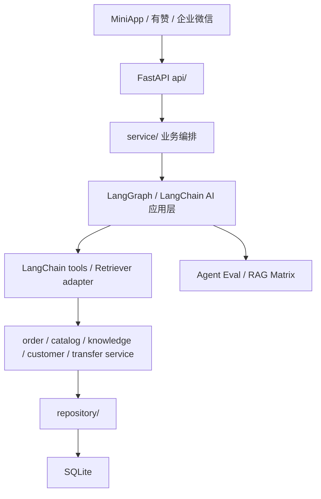

# LangChain AI 应用层作品集说明

> trace_id: `20260709-langchain-ecosystem-ai-layer-takeover`
> status: current
> updated: 2026-07-10

## 项目定位

这是一个真实业务约束下的烘焙门店 AI 客服与员工助手项目，不是纯 demo。项目同时覆盖消费者客服、员工经营助手、有赞订单商品数据、企业微信入口、SQLite 知识库、后台治理和离线评估。

LangChain / LangGraph 在本项目中的定位是接管 AI 应用层：

- 大模型调用适配。
- 工具绑定。
- Agent 编排。
- Retriever adapter。
- structured output。
- tracing config。
- 离线 eval 和报告。

业务事实层继续由项目自己的 service/repository 管理：

- 订单。
- 商品价格和库存。
- 客户线索。
- 知识发布状态。
- 转人工。
- 观测日志。

## 架构边界



关键原则：

- LangChain 编排 AI，不接管数据库。
- LangGraph 编排节点，不改变业务事实来源。
- 员工助手可以用 LLM 做 planner fallback，但最终回复必须确定性输出。
- 客户机器人可以自然语言回答，但订单、库存、退款、转人工必须受工具和 guard 约束。

## 关键代码路径

| 能力 | 路径 |
|---|---|
| LangChain chat model 工厂 | `app/service/agents/llm.py` |
| 客户 LangGraph | `app/service/agents/customer/graph.py` |
| 客户模型适配 | `app/service/agents/customer/model.py` |
| 客户 LangChain tools | `app/service/agents/tools/customer.py` |
| RAG Retriever adapter | `app/service/agents/rag/retriever.py` |
| RAG query plan | `app/service/agents/rag/query.py` |
| RAG rerank adapter | `app/service/agents/rag/rerank.py` |
| RAG retrieval mode gate | `app/config.py`、`app/service/agents/rag/modes.py`、`app/service/chat_context.py` |
| 真实 RAG shadow log 交接与严格观测 | `scripts/build_rag_shadow_log_intake_packet.py`、`scripts/report_rag_shadow_log_observability.py` |
| 员工 LangGraph | `app/service/agents/employee/graph.py` |
| 员工 structured planner | `app/service/agents/employee/structured_planner.py` |
| 员工 LangChain tools | `app/service/agents/tools/employee.py` |
| Agent Eval 模型 | `app/service/agents/evaluation.py` |
| 客户事实敏感 eval | `tests/fixtures/customer_rag_golden_cases.json`、`scripts/check_customer_rag_golden_cases.py` |

## 当前证据真值

作品集清单通过 `scripts/build_langchain_portfolio_evidence_packet.py` 统一读取既有 Agent Eval、RAG shadow、trace 和生产发布证据。清单把“当前工程证据可复核”和“依赖外部输入的增强阶段已完成”拆成两个状态，避免把合成样例、无输入 readiness 或 LangSmith 安全关闭态包装成真实生产效果。

| 状态 | 当前值 | 含义 |
|---|---|---|
| `verified_evidence_ready` | `true` | 当前版本的 Agent Eval、RAG shadow、trace 和严格生产发布证据可复核 |
| `external_evidence_complete` | `false` | E1-E5 仍缺真实脱敏 replay、真实 RAG shadow log、灰度和经人工批准的实际 LangSmith trace 外发证据 |
| `portfolio_complete` | `false` | 作品集已有可展示工程证据，但不能声称后续生产增强计划全部完成 |

```powershell
python scripts/build_langchain_portfolio_evidence_packet.py --require-verified-evidence --summary
python scripts/build_langchain_portfolio_evidence_packet.py --require-complete --summary
```

第一条用于验证当前可展示证据，当前应通过。第二条是完整性严格门禁，在 E1-E5 的真实外部证据齐全前应失败。

E2 的外部交接入口为：

```powershell
python scripts/build_rag_shadow_log_intake_packet.py --summary
```

该命令只生成脱敏交接模板，不会把缺少真实日志的状态包装成完成；当前 `shadow_log_ready=false`。

E1/E2/E6 的统一外部证据交接入口为：

```powershell
python scripts/build_langchain_external_evidence_handoff_packet.py --summary
```

该命令聚合真实 replay 接入包、真实 RAG shadow log 接入包和作品集缺口清单，只输出可填写模板、命令链、缺失动作和边界声明。它不读取原始客户会话、不读取真实 RAG shadow log、不访问业务数据库、不调用外部 LLM、不修改生产服务，也不会把 `external_evidence_complete` 或 `portfolio_complete` 改成 `true`。

## 可执行评估证据

当前离线评估入口：

```powershell
python scripts/eval_customer_agent.py --summary
python scripts/eval_employee_agent.py --summary
python scripts/report_agent_eval.py --latest --json-out reports/agent-eval/latest.json
python scripts/report_retrieval_eval_matrix.py --db data/bot.db --fixture tests/fixtures/customer_rag_golden_cases.json --k 5
python scripts/report_retrieval_shadow_compare.py --db data/bot.db --fixture tests/fixtures/customer_rag_golden_cases.json --k 5 --json-out reports/retrieval-shadow/latest.json
```

当前本地结果：

```text
customer_agent_eval status=passed total=71 failed=0 pass_rate=1.0
employee_agent_eval status=passed total=62 failed=0 pass_rate=1.0
agent_eval status=passed total=133 failed=0 pass_rate=1.0
```

真实 embedding 路径下 RAG 矩阵结果：

```text
模型: BAAI/bge-small-zh-v1.5
语料库: data\bot.db（400 条启用知识）
客户 fixture: 70 条可评估样本
vector: Recall@5=0.9571, MRR=0.819
hybrid: Recall@5=0.9857, MRR=0.8881
planned-hybrid: Recall@5=0.9857, MRR=0.8881
planned-hybrid+rerank: Recall@5=0.9714, MRR=0.9136
```

当前结论：

- 生产默认 `RAG_RETRIEVAL_MODE=hybrid`。
- `planned-hybrid` 已可通过 feature flag 进入 LangChain Retriever adapter 灰度路径，当前指标与 `hybrid` 持平。
- `planned-hybrid-rerank` 仍不热启；虽然 MRR 更高，但 Recall@5 低于 baseline，应继续 shadow compare。

## 事实敏感治理证据

客户机器人不是只做“会聊天”的 demo，而是把客服高风险场景做成可评估资产。

| 场景 | 样本数 | 断言 |
|---|---:|---|
| 售后 after_sales | 8 | 不自行判责、不直接赔付、需要照片/订单/人工确认 |
| 转人工 human_transfer | 16 | 明确要求人工、投诉、过敏、团购、订单退款复合场景必须转人工 |
| 库存 inventory | 5 | 库存必须实时确认，不承诺一定有货或预留 |
| 订单 order | 6 | 不编造订单状态，不直接承诺改地址、提前配送或查询结果 |
| 价格 price | 6 | 报价、优惠、配送费、定制价不能凭空承诺 |
| 退款 refund | 6 | 不承诺全额退款、马上退款或确定到账时间 |

对应证据：

- `tests/fixtures/customer_rag_golden_cases.json`：70 条客户业务样本，其中 30 条为事实敏感样本。
- `scripts/check_customer_rag_golden_cases.py`：结构、分组、敏感场景覆盖、guardrail 策略契约和禁止回复模式检查。
- `scripts/eval_customer_agent.py`：每条敏感 case 输出 `sensitive_scenarios`、`sensitive_policy.<scenario>` 和 `forbidden_reply_patterns`。
- `reports/agent-eval/latest.json`：顶层输出 `sensitive_scenarios` 汇总，可直接展示覆盖面和通过率。

这部分可以在面试中讲成：

> 我没有只靠 prompt 告诉模型“不要胡说”，而是把订单、退款、库存、价格、售后、转人工拆成可枚举场景，用 golden cases、策略关键词契约和禁止回复模式做成离线回归资产。这样每次改 RAG、工具或 LangChain 编排，都能看到高风险客服场景有没有退化。

## 迁移收益

相对全自研链路，LangChain 生态减少了这些自研负担：

- 模型消息格式转换和工具绑定。
- structured output schema 协议。
- LangGraph 节点编排和状态流转。
- Retriever adapter 与 Document metadata 标准形态。
- tracing config 入口。
- 后续接入 LangSmith、reranker、更多模型 provider 的成本。

粗略按当前代码形态估算，LangChain / LangGraph 主要减少的是“协议胶水”和“编排基础设施”，不是业务代码：

| 方向 | 少写/少维护的代码 |
|---|---|
| Tool schema / tool call 适配 | 约 150-250 行自定义 schema、参数解析和工具绑定胶水 |
| Graph 状态流转 | 约 200-300 行手写循环、节点路由和轮次控制胶水 |
| Structured output fallback | 约 80-150 行 JSON schema、解析和 fallback 分支 |
| Retriever adapter 标准化 | 约 80-120 行自定义文档对象、metadata 和异步检索适配 |
| Trace / Eval 统一报告 | 约 100-200 行重复统计与输出格式 glue code |

真正保留下来的代码，大多是必须自研的业务事实治理：订单、库存、退款、客户线索、知识发布状态、转人工和 eval 样本。

保留下来的自研代码是业务必要代码：

- 订单、商品、客户和知识 repository。
- 库存实时注入。
- 转人工和客服接力。
- 员工确定性 finalizer。
- golden cases、能力合约和发布门禁。

## 回滚策略

- 客户机器人模型调用保留 fallback 回复和工具 guard。
- RAG planned/rerank 默认先走离线 eval，不默认打开热路径。
- 员工 planner 保留 rule-first；LangChain structured planner 失败会回落旧 JSON fallback，再失败才返回规则兜底。
- 员工最终回复不交给 LLM，因此不会因为 planner 迁移而改写订单、库存或客户线索事实。

## 面试表达

可以把本项目概括为：

> 我把一个真实烘焙门店客服系统的 AI 应用层迁移到 LangChain / LangGraph：客户机器人使用 LangGraph、LangChain tools 和 RAG Retriever adapter；员工助手使用 LangGraph 和 structured planner，但订单、库存、客户、知识发布状态仍由业务 service/repository 控制。迁移不是为了套框架，而是把模型编排、工具协议、structured output、tracing 和 eval 标准化，同时保留业务事实的可追溯性。

常见追问可以这样回答：

| 问题 | 回答要点 |
|---|---|
| 为什么不是 LlamaIndex？ | 当前核心不是复杂文档解析，而是客服 Agent、工具、RAG、业务事实和评估闭环；LangChain / LangGraph 更适合接管 AI 应用层编排。 |
| 为什么不让 LangChain 接管数据库？ | 订单、库存、退款、客户主档是业务事实，必须走 service/repository 和现有审计边界；LangChain 只做 AI 编排和 adapter。 |
| RAG 是什么范式？ | Modular RAG：SQLite 业务知识 + 商品 RAG + vector/BM25/RRF hybrid + query planning/rerank shadow + eval matrix。 |
| 如何证明不是 demo？ | 有生产 health/ready/callback 证据、133 项双机器人 eval、70 条客户业务样本、事实敏感治理矩阵和 RAG shadow compare；同时用作品集证据清单明确标出尚未完成的真实样本、真实 shadow log、灰度和 LangSmith 外发。 |
