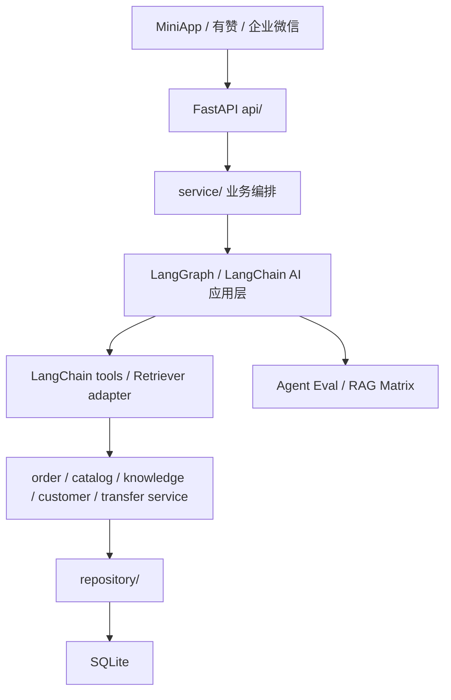

# LangChain AI 应用层作品集说明

> trace_id: `20260709-langchain-ecosystem-ai-layer-takeover`
> status: current
> updated: 2026-07-09

## 项目定位

这是一个真实业务约束下的烘焙门店 AI 客服与员工助手项目，不是纯 demo。项目同时覆盖消费者客服、员工经营助手、有赞订单商品数据、企业微信入口、SQLite 知识库、后台治理和离线评估。

LangChain / LangGraph 在本项目中的定位是接管 AI 应用层：

- 大模型调用适配。
- 工具绑定。
- Agent 编排。
- Retriever adapter。
- structured output。
- tracing config。
- 离线 eval 和报告。

业务事实层继续由项目自己的 service/repository 管理：

- 订单。
- 商品价格和库存。
- 客户线索。
- 知识发布状态。
- 转人工。
- 观测日志。

## 架构边界



关键原则：

- LangChain 编排 AI，不接管数据库。
- LangGraph 编排节点，不改变业务事实来源。
- 员工助手可以用 LLM 做 planner fallback，但最终回复必须确定性输出。
- 客户机器人可以自然语言回答，但订单、库存、退款、转人工必须受工具和 guard 约束。

## 关键代码路径

| 能力 | 路径 |
|---|---|
| LangChain chat model 工厂 | `app/service/agents/llm.py` |
| 客户 LangGraph | `app/service/agents/customer/graph.py` |
| 客户模型适配 | `app/service/agents/customer/model.py` |
| 客户 LangChain tools | `app/service/agents/tools/customer.py` |
| RAG Retriever adapter | `app/service/agents/rag/retriever.py` |
| RAG query plan | `app/service/agents/rag/query.py` |
| RAG rerank adapter | `app/service/agents/rag/rerank.py` |
| 员工 LangGraph | `app/service/agents/employee/graph.py` |
| 员工 structured planner | `app/service/agents/employee/structured_planner.py` |
| 员工 LangChain tools | `app/service/agents/tools/employee.py` |
| Agent Eval 模型 | `app/service/agents/evaluation.py` |

## 可执行评估证据

当前离线评估入口：

```powershell
python scripts/eval_customer_agent.py --summary
python scripts/eval_employee_agent.py --summary
python scripts/report_agent_eval.py --latest
python scripts/report_retrieval_eval_matrix.py --db data/bot.db --fixture tests/fixtures/customer_rag_golden_cases.json --k 5
```

当前本地结果：

```text
customer_agent_eval status=passed total=9 failed=0 pass_rate=1.0
employee_agent_eval status=passed total=49 failed=0 pass_rate=1.0
agent_eval status=passed total=58 failed=0 pass_rate=1.0
```

真实 embedding 路径下 RAG 矩阵结果：

```text
模型: BAAI/bge-small-zh-v1.5
语料库: data\bot.db（400 条启用知识）
向量构建耗时: 约 29.06 秒
整轮矩阵耗时: 约 77 秒
vector: Recall@5=1.0, MRR=0.9167
hybrid: Recall@5=1.0, MRR=1.0
planned-hybrid: Recall@5=1.0, MRR=1.0
planned-hybrid+rerank: Recall@5=1.0, MRR=1.0
```

## 迁移收益

相对全自研链路，LangChain 生态减少了这些自研负担：

- 模型消息格式转换和工具绑定。
- structured output schema 协议。
- LangGraph 节点编排和状态流转。
- Retriever adapter 与 Document metadata 标准形态。
- tracing config 入口。
- 后续接入 LangSmith、reranker、更多模型 provider 的成本。

保留下来的自研代码是业务必要代码：

- 订单、商品、客户和知识 repository。
- 库存实时注入。
- 转人工和客服接力。
- 员工确定性 finalizer。
- golden cases、能力合约和发布门禁。

## 回滚策略

- 客户机器人模型调用保留 fallback 回复和工具 guard。
- RAG planned/rerank 默认先走离线 eval，不默认打开热路径。
- 员工 planner 保留 rule-first；LangChain structured planner 失败会回落旧 JSON fallback，再失败才返回规则兜底。
- 员工最终回复不交给 LLM，因此不会因为 planner 迁移而改写订单、库存或客户线索事实。

## 面试表达

可以把本项目概括为：

> 我把一个真实烘焙门店客服系统的 AI 应用层迁移到 LangChain / LangGraph：客户机器人使用 LangGraph、LangChain tools 和 RAG Retriever adapter；员工助手使用 LangGraph 和 structured planner，但订单、库存、客户、知识发布状态仍由业务 service/repository 控制。迁移不是为了套框架，而是把模型编排、工具协议、structured output、tracing 和 eval 标准化，同时保留业务事实的可追溯性。
